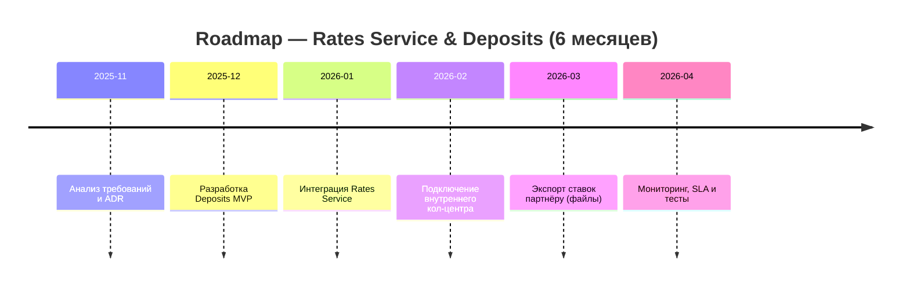

### **Название задачи:** Передача ставок в кол-центр
### **Автор:** Иван Иванов
### **Дата:** 01.01.1990
### **Функциональные требования**
Опишите здесь верхнеуровневые Use Cases. Их нужно оформить в виде таблицы с пошаговым описанием:

|**№**|**Действующие лица или системы**|**Use Case**|**Описание**|
|:-:|---|---|---|
|1|Оператор внутреннего кол-центра|Просмотр актуальных ставок|Оператор видит актуальные ставки через API RatesService в интерфейсе кол-центра.|
|2|Партнёрский кол-центр|Получение ставок|Партнёр получает ежедневную/инкрементальную CSV-выгрузку через SFTP.|
|3|Бизнес / Back-office|Обновление ставок|Сотрудник депозита обновляет ставки через UI RatesService; версии и аудит фиксируются.|
|4|InternetBank / Website|Вычитка ставок|Просмотр актуальных и персональных ставок из RatesService (кэш).|

### **Нефункциональные требования**
Опишите здесь нефункциональные требования и архитектурно значимые требования.

|**№**|**Требование**|
| :-: | :- |
|  F1 | API для чтения ставок — REST, поддержка версий.|
|  F2 | Экспорт CSV по расписанию и по требованию (включая delta). |
|  R1 | Гарантия доставки файлов партнёру (SFTP + контроль целостности, подпись). |
|  P1 | RT обновления ставок — изменения доступны клиентам не позднее, чем через N минут (N = 15 в MVP). |
|  S1 | Логи изменений и аудит; ролевая модель — кто может менять ставки. |
| +R1 | Партнёрский кол-центр не может делать API-вызовы — только файлы. |

### **Решение**
[диаграмы](diagram.png)
[диаграмы 2](diagram2.png)

Также опишите, какой логикой вы руководствовались в ходе принятия решений и выбора технологий. Не забывайте, что необходимо учесть все функциональные и нефункциональные требования.
### **Альтернативы**
1. Push через API на партнёров — нельзя (партнёр требует files).
2. Репликация таблиц БД — надежно, но небезопасно и требует согласований.
3. Использовать ETL-репортинг (BI) — подходит для batch, но медленнее.

**Недостатки, ограничения, риски**
1. Риск рассинхронизации версий ставок между системами (решается версионированием и контрольными суммами файлов).
2. Требуется SLA по доставке CSV и мониторинг успешной загрузки партнёром.
3. Необходимо обеспечить защита файлов (SFTP + подпись).

### Сформируйте список крупных задач для каждой системы из ADR для будущего планирования.
#### RatesService
- Дизайн данных ставок (схема, версия, метаданые)
- Реализация REST API (GET/POST/PUT)
- UI для администраторов (CRUD + аудит)
- Экспорт CSV/SFTP + подпись/контроль целостности
- Мониторинг и алерты

#### Интернет-банк / сайт
- Интеграция чтения ставок из RatesAPI
- Кэширование на уровне frontend / CDN
- UI отображения персонализированной ставки

#### Система кол-центра (внутр.)
- Подключение к RatesAPI для отображения ставок
- Тестирование и обучение операторов

#### Партнёрский кол-центр
- Настройка SFTP-пайпа и тесты приема файлов
- Согласование формата CSV и сигнатуры

#### АБС
- Опциональная синхронизация справочных данных (ограниченная)

### Подготовьте RoadMap

Месяц 1: Design + Начало разработки RatesService (API и DB).
Месяц 2: Admin UI, экспорт CSV, интеграция с внутренним кол-центром.
Месяц 3: Интеграция интернет-банка и сайта, тестирование, настройка партнёра (SFTP).
Месяц 4: Нагрузочное тестирование, мониторинг, правки.
Месяц 5: Пилотный запуск, сбор обратной связи, исправления.
Месяц 6: Полный rollout (MVP) и подготовка к автоматизации ставок/предодобренных предложений.

